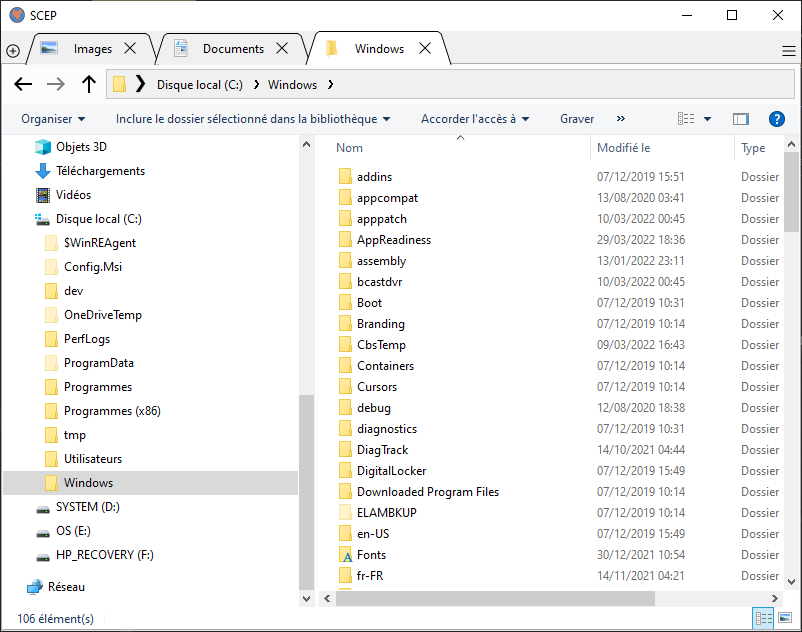
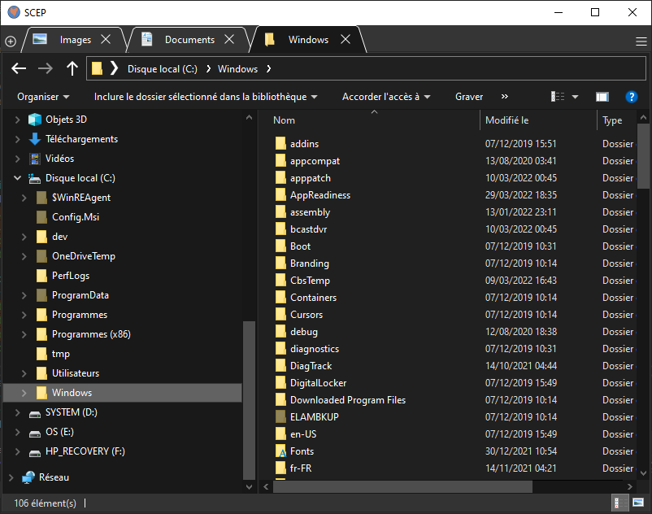
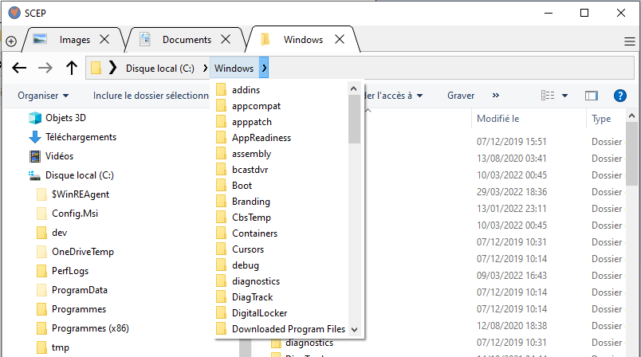
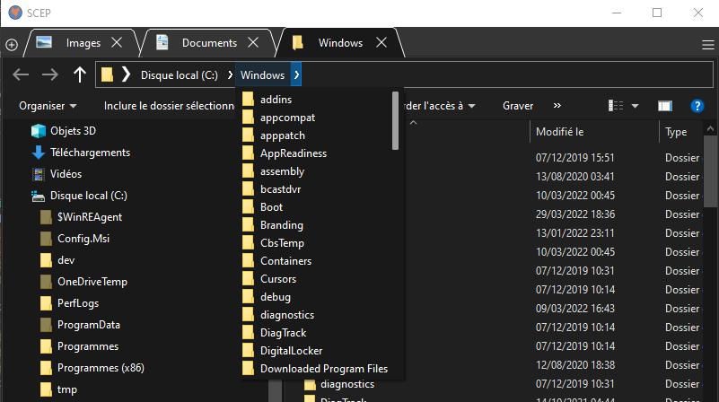
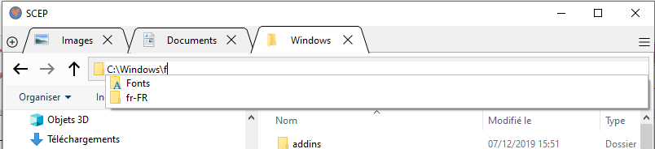
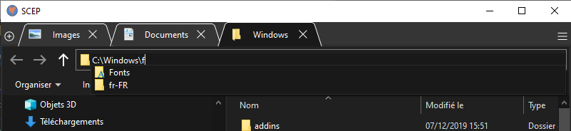
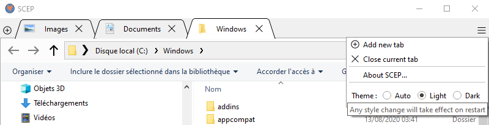
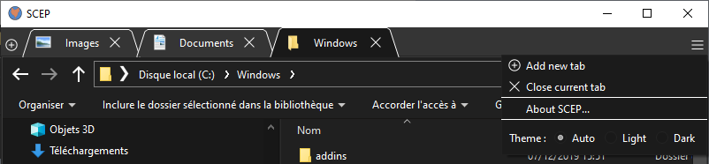

  

# SCEP

## Description

SCEP is a multi tab file explorer for Windows.

SCEP does not aim to provide bunches of additional features to the Windows file explorer but has a clear focus on a simple goal : integrate, as seamlessly as possible, a multi tab mecanism to the native file explorer.

The goal is quite similar to Clover's but the technical approach is totally different and the code is released under MIT license.

## Licensing

SCEP is released under MIT license.

## Gallery

### General

| Light mode                                | Dark mode                                |
| ----------------------------------------- | ---------------------------------------- |
|     |     |
|   |   |
|  |  |
|     |     |

## Versions

### SCEP 0.1 - 29/03/2022

- Embedding file explorer in tabs
- Open folder in new tab with middle click or through a context menu dedicated entry
- Close tab with close button or middle click
- Dark mode / Light mode
- Breadcrumb bar
- Address bar with autocompletion and icons
- Full support for translated paths (Users, Desktop, Documents... folders)
- Full support for Windows Known Folders, including virtual folders (such as Network or Libraries)
- Main hot keys handled :
  - CTRL+C : copy
  - CTRL+X : cut
  - CTRL+V : paste
  - F2 : rename
  - CTRL+L : address bar focus
  - DEL : delete
  - ALT+UP : navigate up
  - ALT+LEFT : navigate backward
  - ALT+RIGHT : navigate forward
  - CTRL+T : open new tab
  - CTRL+W : close current tab
- Full support for icons and icons overlays.
- On startup, SCEP reopens the previous tabs
- Windows installer

### Towards SCEP 1.0

Major missing features:
- **Search**
- I18N of the GUI and the installation program
- Autoupdate (with https://github.com/VioletGiraffe/github-releases-autoupdater ?)

Minor missing features:
- Handle remaining hot keys :
  - CTRL+Z : undo
  - CTRL+Y : redo
  - CTRL+A : select all
  - CTRL+SHIFT+N : create new folder
  - SHIFT+DEL : delete (without bin)
- Handle navigation inside archives (zip) for breadcrumvs and address bars
- Better CTRL-TAB behaviour
- Tab context menu : close tab, duplicate tab, copy full path to clipboard, close other tabs...
- Reopen closed tabs (and its shortcut CTRL+SHIFT+T)
- Add settings to allow hidden files and folders in breadcrumb bar address bar (linked to the file explorer equivalent setting ??)
- Add history menu on backward / forward buttons
- Middle click on backward / forward butttons opens a new tab
- Windows + Shift + E to set focus to a running SCEP instance and open a new tab

Others :
- Doxygen comments and html generation
- CI/CD on GitHub

Known bugs :
- "&" character is not well handled in tab name
- The light style palette does to perfectly match the Windows lighr palette.
- Media addition or deletion is not handled in the breadcrumb bar

## Third party Code, Libraries and Assets

* GUI built with Qt Toolkit (LGPL license, (C) 2017 The Qt Company Ltd.): https://www.qt.io/product/qt6
* Windows dark mode detection and activation made with linkollector-win (MIT license, (C) 2020 Andreas Schulz): https://github.com/Longhanks/linkollector-win
* Breadcrumb bar developed as a C++ port and adaptation of breadcrumbsaddressbar (MIT license, (C) 2019 Makarov Andrey): https://github.com/Winand/breadcrumbsaddressbar
* Icons from Icons8: https://icons8.com/

## Main design

SCEP is build as a Qt main window containing a QTabWidget, each tab embedding a native Windows file explorer window.

The win32 window corresponding to the windows file explorer can be integrated in a Qt application thanks to the following methods: `QWindow::fromWinId(HWND)` and `QWidget::createWindowContainer(QWindow*)`.

The file explorer window is created as a `IExplorerBrowser`.
* Pros: It creates a full explorer window that can be tweaked (catch middle click event, react on user navigation, add custom entry to context menu...)
* Cons: The explorer window does not contain the ribbon nor the breadcrumb bar/address bar.

Several other tests have been made for this integration (launch `explorer.exe`, create `IWebBrowser2`...) and their drawbacks exceeded the current implementation ones (hard or impossible to tweak `explorer.exe`, parlty disabled or ineffective ribbon for  `IWebBrowser2`...).\
That is the reason why SCEP has to reimplement the following elements:
* Navigation buttons
* Breadcrumb bar
* Address bar
* Search

## Building from sources

### Prerequisites

- Powershell >= 5.1
- Microsoft Visual Studio 2017 or higher\
**Warning** : SCEP can be build using VS 2017 but the packaging process requires VS 2019 or higher
- Qt5 or Qt 6\
**Warning** : SCEP can be build using Qt 5 but the packaging process requires Qt 6
- Visual Studio extension : Microsoft Visual Studio Installer Projects

Tested platforms:
* Successfully built for x64 and packaged on Windows 10 with Microsoft Visual Studio 2022 and Qt 6.2
* Successfully built for x64 (but not packaged) on Windows 10 with Microsoft Visual Studio 2017 and Qt 5.14

## Setting up environment

In the SCEP root folder:
* Copy `env.ps1.proto` as `env.ps1`
* Fill the expected environment variables:
  * `VS_DIR`: The Microsoft Visual Studio root directory
  * `BUILD`: The build platform, should be `x86` (32 bits) or `x64` (64 bits)\
  **Warning** : Only tested with `x64`
  * `QT_DIR`: The Qt root directory

## Build, develop and package

Open Powershell in the SCEP root folder:
* `.\qmake.ps1` calls `qmake.exe` and generates the Microsoft Visual Studio (MSVC) solution.
* `.\devenv.ps1` opens the SCEP solution in MSVC (aka `devenv.exe`)
* In MSVC, it is possible to build, modify and debug SCEP
* **Note**: a future script `.\build.ps1` will allow to build SCEP without opening MSVC and will be able to be used in CI/CD context.
* `.\setup.ps1` packages SCEP and creates an installation program in the SCEP root folder.\
This script requires SCEP to be built in release mode beforehand.\
The installation program name is `SCEP_x.y.z_[x86/x64].msi`, with `x`, `y` and `z` standing for major, minor and patch version numbers.

## Versionning

The version numbers (major, minor, patch format) are set in the `VERSION` file located in the SCEP root folder.

In order to change the version numbers, it is necessary to :
* Modify the `VERSION` file,
* Recreate the MSVC solution (`.\qmake.ps1`)
* Rebuild SCEP (in MSVSC or with `.\build.ps1`)
* Generate a new setup (`.\setup.ps1`)\
**Warning**: This script will warn about 2 modifications made to `SCEP.vdproj`: `ProductVersion` have been updated to match `VERSION` file content and `ProductCode` have been overwritten with a new GUID in order to handle smooth update. **These modifications must be commited and pushed.**